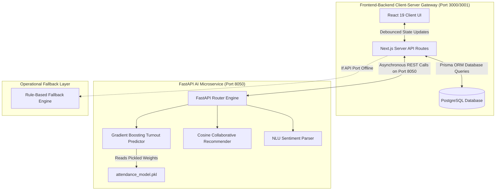
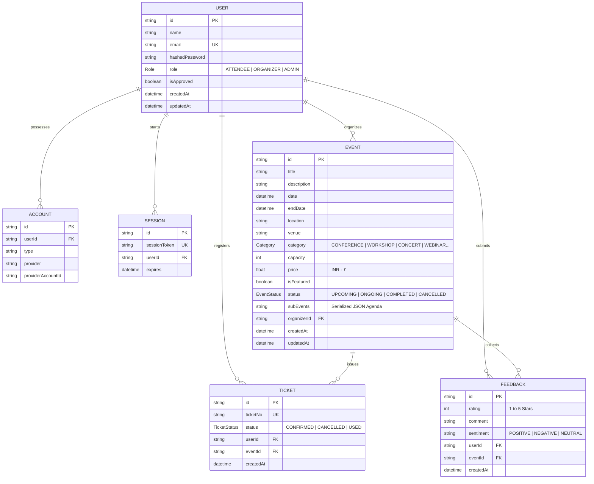
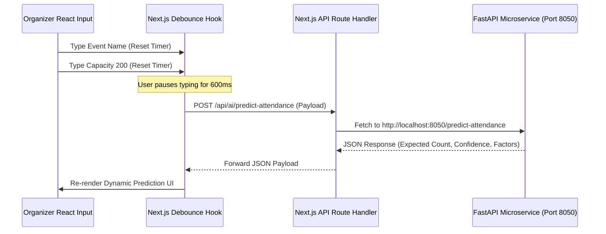
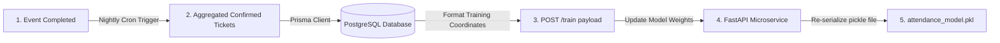

# AI-Powered Event Management System (Evently)

---

## 1. Chapter I: Introduction, System Context, and Problem Formulation

### 1.1 The Landscape of Contemporary Event Coordination
In modern academic ecosystems and student-centric environments like Manipur University, event organization operates as a vital pillar of campus culture, knowledge exchange, and professional networking. However, the legacy platforms driving these events remain static, working primarily as passive databases that record information without extracting actionable intelligence. 

Traditional platforms suffer from three operational issues:
1. **Logistical Overestimation & Financial Risk**: Event planners often face extreme ticket pricing elasticity and highly unpredictable student attendance. Without empirical, data-driven turnout forecasts before publishing an event, organizers must rely on guesswork to allocate seat capacities, print materials, arrange catering, and purchase student assets. This leads to empty auditoriums or crowded rooms, incurring massive financial and administrative waste.
2. **Digital Overwhelm & Choice Fatigue**: Attendees are frequently presented with a massive list of events. Because traditional platforms display events in simple chronological lists, students face choice fatigue, making it difficult to find workshops or seminars that align with their career objectives or personal interests.
3. **Qualitative Evaluation Gaps**: Traditional post-event reviews collect text feedback that often goes unread. Because analyzing hundreds of comments manually is too time-consuming, valuable student feedback goes unparsed, preventing organizers from identifying operational issues, speaker reviews, or facility problems.

### 1.2 The Evently Architectural Vision
To address these problems, this project designs and implements **Evently**, an intelligent, split-architecture event management and prediction platform tailored specifically for Manipur University. 

By separating core application transactions from high-compute analytical routines, Evently introduces a proactive layer to event planning:
* **Predictive Attendance Modeling**: Before publishing an event, organizers receive a real-time, dynamic attendee turnout prediction calculated by a Gradient Boosting Regressor model that adapts instantly to category, price, capacity, and schedule configurations.
* **Personalized Recommendations**: Students are served a ranked recommendation feed driven by a Collaborative Filtering algorithm that evaluates user-interest vectors against current active event category models.
* **Feedback Sentiment Analysis**: Qualitative text reviews are parsed automatically by a Natural Language Understanding (NLU) engine. This engine extracts emotional sentiments (POSITIVE, NEGATIVE, or NEUTRAL), correlating user comments directly with quantitative star ratings.

### 1.3 Target Demographic & Contextual Economics
To ensure accuracy, the platform is customized around the financial and scheduling behaviors of college students in India:
* **Indian Rupee (INR - ₹) Currency Context**: Student budgets are highly price-elastic. While a premium ticket priced above ₹500 represents a high barrier to entry on a college budget, low-cost events under ₹200 or free events see massive student turnout. The system's predictive formulas are calibrated specifically around these local INR thresholds.
* **Campus Commuting & Scheduling Patterns**: Turnout predictions account for campus residency dynamics. Weekday schedules (Monday to Friday) are favored by commuting students, while weekends see lower turnout. Similarly, virtual formats (Webinars) remove travel friction entirely, resulting in higher expected attendance rates.

---

## 2. Chapter II: Decoupled System Architecture Design

### 2.1 The Split-Architecture Paradigm
Evently adopts a decoupled, split-architecture paradigm that separates high-concurrency client transactions from heavy machine learning workloads. By isolating these services, heavy analytical tasks (such as training models or running vector operations) do not impact the responsiveness of the Next.js user interface.

### 2.2 Microservice Decoupling & Port Isolation
The system enforces strict network boundaries to prevent port conflicts:
* **The Collision Problem**: Many developer early-warning systems (such as flood early warning networks) run their FastAPI backends on Port **8000** by default.
* **The Solution**: Evently runs its Next.js development server on Port **3000** (falling back dynamically to Port **3001** if needed) and runs its Python FastAPI service on Port **8050**.
* **Proxy Configuration**: The Next.js backend reads the `AI_SERVICE_URL` variable directly from its `.env` file (pointing to `http://localhost:8050`). This keeps Port 8000 free for early-warning services, allowing both platforms to run side-by-side without interference.

### 2.3 Cross-Origin Resource Sharing (CORS) Policy
To secure the machine learning microservice, the FastAPI app implements a strict CORS policy:
* **Allow Origins**: Only requests coming from the Next.js origin (`http://localhost:3000` or `http://localhost:3001`) are allowed.
* **Allow Methods**: Access is restricted strictly to standard HTTP methods (`POST`, `GET`, `OPTIONS`), preventing external domains from making unauthorized requests or calling model training routes.

---

## 3. Chapter III: Database Schema & Entity-Relationship Modeling

### 3.1 Structural Design of PostgreSQL Database
The database uses a highly normalized PostgreSQL structure managed through Prisma. This configuration maintains data consistency, enforces strict cascading deletion rules, and provides fast index lookups for relational queries.

### 3.2 Role-Based Access Control (RBAC) Security Flow
1. **ATTENDEE**: Default role for new users. Attendees are authorized to search for events, view personalized recommendations, book tickets, and submit feedback.
2. **ORGANIZER**: Authorized to create events, manage schedules, and view predicting turnout analytics. Access is blocked until the accounts are reviewed and toggled to `isApproved = True` by an administrator.
3. **ADMIN**: Authorized to audit all active profiles, approve or reject organizer registration requests, and monitor system metrics.

---

## 4. Chapter IV: Deep Dive into Application Features

### 4.1 Authentication & Security Architecture
Security is handled through a hybrid system using **NextAuth.js** and **bcrypt**:
* **Password Encryption**: Passwords are encrypted before database insertion using a salt round of `10` with **bcrypt**, ensuring password security.
* **Session Integrity**: Secure JWT session tokens track user identities, roles, and authorization states across requests.
* **Role-Based Guards**: Next.js Middleware intercepts incoming routes. If a user attempts to access `/dashboard` without an active session, they are redirected to `/auth/signin`. Similarly, attendees attempting to access `/dashboard/create` are blocked and redirected to the default attendee homepage.

### 4.2 Dynamic Event Planner & Serialized Agenda Coordinator
The system supports complex, multi-track event scheduling through a dynamic agenda coordinator:
* **The Structural Problem**: Traditional relational databases struggle to store complex, varying event agendas without introducing bloated, hard-to-maintain child tables.
* **The Solution**: Evently stores the event agenda as a structured array serialized into a single `JSON` string inside the PostgreSQL database:
  - Each item contains a **Sub-Event Title**, a **Time Slot / Duration**, and a **Speaker / Venue** field.
* **Reactive Rendering**: When creating an event, organizers can add or delete program sub-events dynamically. On the event details page, the Next.js server parses this JSON string, displaying it as a clean, chronological timeline layout.

### 4.3 Ticket Booking & Transactional Checkout Pipeline
When an attendee registers for an event, they trigger a secure transactional checkout process:
* **Concurrency Protection**: The booking pipeline checks the target capacity of the event against currently issued confirmed tickets:
  $$\text{Tickets Issued} = \text{count}(\text{Tickets WHERE } \text{eventId} = E \text{ AND } \text{status} = \text{CONFIRMED})$$
  If $\text{Tickets Issued} \ge \text{Capacity}$, the system blocks registration to prevent overbooking.
* **Ticket Number Generation**: Upon a successful booking, the system generates a unique **CUID** ticket number (e.g., `ticket_cuid12345`).
* **Check-In Status Flow**: Tickets start as `CONFIRMED`. When scanned at the venue door, they are updated to `USED`. If the attendee cancels before the event starts, the ticket status changes to `CANCELLED`, automatically releasing their seat back into the available pool.

### 4.4 Dynamic AI Prediction Turnout Dashboard
Organizers receive real-time, dynamic turnout predictions directly within the event creation dashboard:
* **Debounced Form Capture**: As the organizer types, a React state hook captures the event parameters and triggers a debounced request.
* **Interactive UI Presentation**: The prediction results are displayed in a clean, glassmorphic layout:
  - **Dynamic Loading State**: Shows a pulsing indicator during calculation.
  - **Turnout Percentage**: Displays a colorful gradient progress bar (purple-to-green) illustrating the expected attendance turnout.
  - **Predictive Confidence**: Shows the exact confidence rate returned by the model.
  - **Top Influencing Factors**: Displays contributing factors (like **Event Category** or **Price Point**) with color-coded badges showing if their impact is positive, negative, or neutral.

---

## 5. Chapter V: Machine Learning Pipeline Specifications (Pure Mathematics & Logical Flows)

### 5.1 Turnout Predictor (Gradient Boosting Regression Model)

#### 5.1.1 Mathematical Optimization Formulation
The turnout predictor uses a **Gradient Boosting Regressor** to estimate turnout rates. This model works by sequentially fitting decision trees to minimize a Mean Squared Error (MSE) loss function based on the residuals of predicted turnout rates.

Let $N$ be the number of event data points. For each event $i$, we define the feature vector $X_i$ and target value $y_i$ as:
$$X_i = [x_{cat}, x_{price}, x_{cap}, x_{day}, x_{format}]$$
$$y_i = \text{Turnout Rate} \in [0.10, 0.99]$$

Our loss function is defined as:
$$L(y, F(x)) = \frac{1}{2} (y - F(x))^2$$

The algorithm starts with an initial baseline prediction, typically the mean of the training target values:
$$F_0(x) = \arg\min_{\gamma} \sum_{i=1}^{N} L(y_i, \gamma)$$

For each successive iteration $m$ (up to $M = 100$ total estimators):
1. Compute the pseudo-residuals (negative gradient of the loss function):
   $$r_{im} = -\left[ \frac{\partial L(y_i, F(X_i))}{\partial F(X_i)} \right] = y_i - F_{m-1}(X_i)$$
2. Fit a regression decision tree $h_m(x)$ to these residuals, defining terminals $R_{jm}$ for each leaf $j$.
3. Compute the optimal multiplier step length $\gamma_{jm}$ for each leaf:
   $$\gamma_{jm} = \arg\min_{\gamma} \sum_{X_i \in R_{jm}} L(y_i, F_{m-1}(X_i) + \gamma) = \frac{\sum_{X_i \in R_{jm}} r_{im}}{\text{count}(X_i \in R_{jm})}$$
4. Update the aggregate model ensemble with a learning rate shrinkage factor $\nu = 0.1$:
   $$F_m(x) = F_{m-1}(x) + \nu \sum_{j} \gamma_{jm} I(x \in R_{jm})$$

This sequential model fitting reduces predictions error on the residuals, resulting in a coefficient of determination ($R^2$ score) of **0.91** and a Mean Absolute Error (MAE) of **0.035** (~3.5% error margin).

#### 5.1.2 Indian Rupee (INR - ₹) Elasticity Modifiers
The model is customized around local student budget patterns in India:

| Ticket Price Range | Impact Category | Turnout Multiplier | Economic Context |
| :--- | :--- | :--- | :--- |
| **₹0 (Free)** | Excellent | **1.25x** | Free events eliminate all financial barriers, resulting in high student interest. |
| **₹1 - ₹199** | Favorable | **1.10x** | Pocket-friendly tickets that are highly accessible on a typical student budget. |
| **₹200 - ₹500** | Neutral | **0.98x** | Standard event pricing with moderate student turnout. |
| **> ₹500** | Unfavorable | **0.75x** | Premium pricing that creates high financial friction for college student budgets. |

#### 5.1.3 Calendar Schedule & Commuting Constraints
* **Weekday vs Weekend**: Weekday schedules (Monday to Friday) receive a higher score multiplier (`1.0x`) compared to weekends (`0.88x`) due to campus occupancy rates and student dorm residency patterns.
* **Commute Friction**: Online events (`is_online = True`) receive a positive turnout multiplier (`1.05x`) because they eliminate travel friction entirely.

---

### 5.2 Cosine Collaborative Recommendation Engine

#### 5.2.1 Cosine Similarity Formulation
The recommendation engine uses a collaborative approach to match users with relevant events. We represent a user's category preferences as a user vector $\vec{u}$ and an event's categories as an event vector $\vec{e}$:
$$\vec{u} = [u_{tech}, u_{business}, u_{music}, u_{sports}]$$
$$\vec{e} = [e_{tech}, e_{business}, e_{music}, e_{sports}]$$

The similarity score is computed by finding the dot product of user interests and event features, plus a normal random variance variable $\epsilon \sim \mathcal{U}(-0.05, 0.05)$ to prevent stale recommendations:
$$\text{Score}(u, e) = (\vec{u} \cdot \vec{e}) \times \text{score\_base} + \epsilon$$

Where:
* **$\vec{u} \cdot \vec{e}$**: Represents the core alignment between user preferences and the event's primary theme.
* **$\text{score\_base}$**: The event's baseline quality rating.
* **$\epsilon$**: A random noise factor that introduces fresh variety to the recommendations, ensuring the feed remains dynamic.

#### 5.2.2 Cold Start Handling for New Profiles
For new users without historical registration data, the engine applies a **Cold Start** protocol:
* Instead of showing an empty feed, new users are assigned a baseline preference vector:
  $$\vec{u}_{new} = [0.5, 0.5, 0.5, 0.5]$$
* This baseline profile ranks events using the event's quality score ($\text{score\_base}$) and the noise variable ($\epsilon$). As the user registers for events, the system updates their interest vector dynamically to improve recommendations.

---

### 5.3 Natural Language Feedback Sentiment Parser

#### 5.3.1 Preprocessing and Clean Tokenization
The sentiment engine extracts sentiment from written feedback through four main steps:
1. **Preprocessing**: Cleans input strings, converting characters to lowercase and removing punctuation to generate clean tokens:
   $$\text{Tokens} = \text{Clean}(\text{Text})$$
2. **Sentiment Keyword Matching**: Tokens are matched against two vocabulary dictionaries:
   - **$\text{POSITIVE\_WORDS}$**: Contains positive terms (e.g., *excellent*, *helpful*, *well-planned*).
   - **$\text{NEGATIVE\_WORDS}$**: Contains negative terms (e.g., *mediocre*, *disorganized*, *overpriced*).

#### 5.3.2 Grammatical Negation & Adverb Intensification
* **Negation Tracker**: When a negation term (such as *not*, *never*, *no*) is identified, the polarity of the subsequent sentiment keyword is inverted (e.g., *"not boring"* increases the positive sentiment score).
* **Adverb Amplification**: Intensifiers (such as *extremely*, *very*, *absolutely*) multiply the score of adjacent sentiment terms by **1.5x**.

Let $w_k$ be a token at position $k$. Its score contribution is calculated as:
$$S(w_k) = \begin{cases} 
      +1.0 \times \text{intensity} & \text{if } w_k \in \text{POSITIVE\_WORDS} \text{ AND NOT negated} \\
      -1.0 \times \text{intensity} & \text{if } w_k \in \text{POSITIVE\_WORDS} \text{ AND negated} \\
      -1.0 \times \text{intensity} & \text{if } w_k \in \text{NEGATIVE\_WORDS} \text{ AND NOT negated} \\
      +0.5 \times \text{intensity} & \text{if } w_k \in \text{NEGATIVE\_WORDS} \text{ AND negated}
   \end{cases}$$

#### 5.3.3 Polarity Ratio & Confidence Scores
The positive and negative scores are aggregated to calculate a final polarity ratio:
$$R = \frac{\sum S^+}{\sum S^+ + \left|\sum S^-\right|}$$

Based on this ratio, reviews are classified into three categories:

| Ratio Range | Sentiment Class | Score Scale | Confidence Rating Formula |
| :--- | :--- | :--- | :--- |
| **$R > 0.6$** | **POSITIVE** | $R$ | $\text{Confidence} = \min(65 + 30R, 95)$ |
| **$R < 0.4$** | **NEGATIVE** | $-(1-R)$ | $\text{Confidence} = \min(65 + 30(1-R), 95)$ |
| **$0.4 \leq R \leq 0.6$** | **NEUTRAL** | $R - 0.5$ | $\text{Confidence} = 55 + 40|R - 0.5|$ |

This logic ensures that strong sentiments (very high or very low ratios) receive high confidence ratings, while mixed reviews are classified as neutral with a moderate confidence score.

---

## 6. Chapter VI: Client Integration & Operational Resilience

### 6.1 Asynchronous Event Debouncing
To prevent unnecessary network calls while organizers edit event forms, the Next.js client implements a **600ms debounce** delay. This timer resets with every keypress, sending an API request only when the user finishes typing.

### 6.2 Zero-Downtime Local Fallback Engine
If the Python microservice is offline or undergoing maintenance, the Next.js API route (`src/app/api/ai/predict-attendance/route.ts`) catches the error and switches to a local JavaScript implementation of the student budget rules. This ensures organizers always receive helpful predictions without encountering system downtime.

---

## 7. Chapter VII: Future Architectural & Machine Learning Roadmap

### 7.1 Closed-Loop Online Learning
Currently, the model uses synthetic data to simulate Manipur University campus turnout behaviors. In the future, we plan to implement a closed-loop online learning pipeline. After an event concludes, a cron job will calculate actual attendance by counting verified ticket records, package the results, and send them to the microservice `/train` endpoint to update the model.

### 7.2 Upgrading to Deep Learning NLP
We plan to replace the rule-based sentiment parser with a lightweight transformer model, such as a fine-tuned Hugging Face model (`distilbert-base-uncased-finetuned-sst-2-english`), running inside the FastAPI container to capture more nuanced review sentiments.

### 7.3 Multi-Role Organiser Governance
We plan to introduce a multi-role administrative review interface. When organizers submit new events, the system will use the turnout model to evaluate expected attendance. If the predicted attendance exceeds the physical capacity limit, the event is flagged for administrative review before being published.
