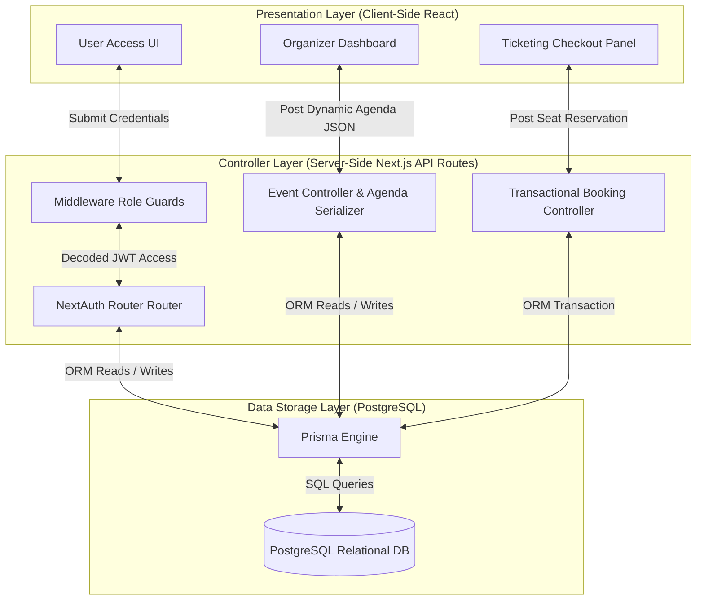
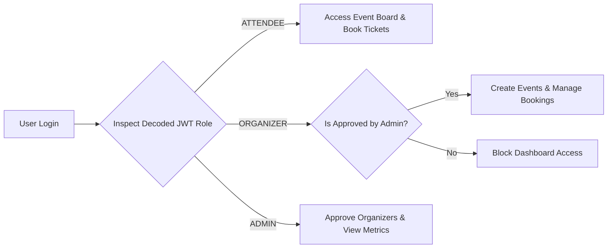
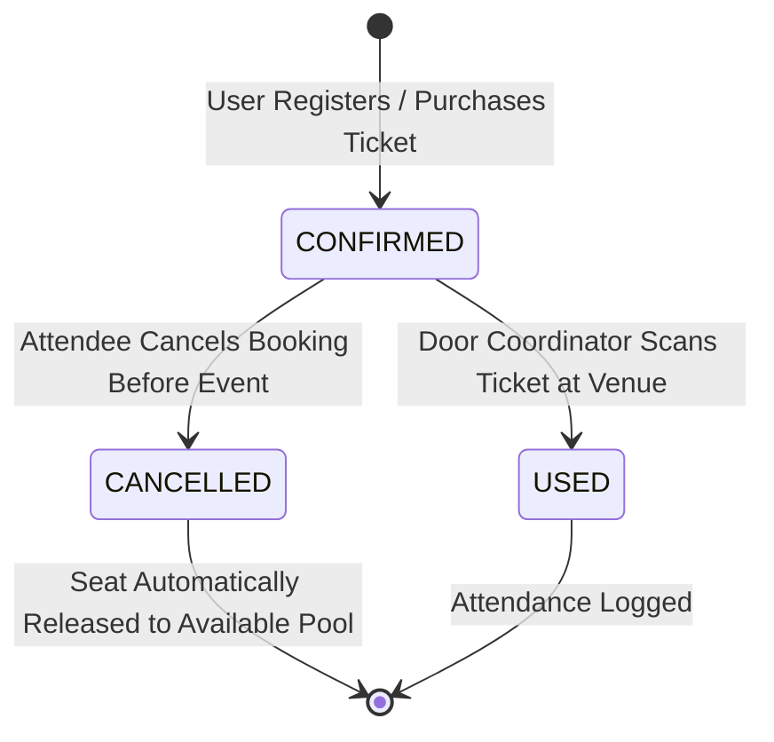
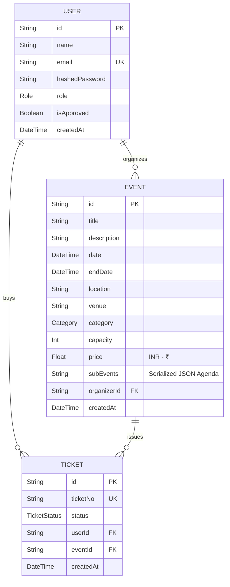

# 🎓 Evently: Intelligent Event Management System
## Phase 2 Technical Documentation & Academic Presentation Guide

---

> [!IMPORTANT]
> **Phase 2 Development Focus**: While Phase 1 established the initial database connections and simple page structures, **Phase 2** completes the core operational pipelines of **Evently**. This documentation outlines the system design, relational database relationships, security features, and client-server workflows for the platform's three core pillars: **User Authentication (Login & Signup)**, **Event Management & Creation**, and **The Transactional Ticketing System**.

---

## 📑 Table of Contents

1. [Executive Summary & Core Objectives](#1-executive-summary--core-objectives)
2. [Platform Architecture & Data Flows](#2-platform-architecture--data-flows)
    - 2.1 [Three-Tier Monolithic System Architecture](#21-three-tier-monolithic-system-architecture)
    - 2.2 [Dynamic Request-Response Data Lifecycles](#22-dynamic-request-response-data-lifecycles)
3. [User Authentication & Security Architecture (Login & Signup)](#3-user-authentication--security-architecture-login--signup)
    - 3.1 [Credential Encryption & Security Design](#31-credential-encryption--security-design)
    - 3.2 [Session State Management via JWT Tokens](#32-session-state-management-via-jwt-tokens)
    - 3.3 [Role-Based Access Control (RBAC) & Route Guards](#33-role-based-access-control-rbac--route-guards)
4. [Event Management & Serialized Creation Engine](#4-event-management--serialized-creation-engine)
    - 4.1 [Event Creation Workflow and Validation](#41-event-creation-workflow-and-validation)
    - 4.2 [Serialized Agenda Coordination (Dynamic JSON Fields)](#42-serialized-agenda-coordination-dynamic-json-fields)
    - 4.3 [Regional Formatting & Price Constraints (INR - ₹)](#43-regional-formatting--price-constraints-inr---)
5. [Transactional Ticketing & Booking Pipeline](#5-transactional-ticketing--booking-pipeline)
    - 5.1 [Capacity Validation & Concurrency Management](#51-capacity-validation--concurrency-management)
    - 5.2 [Unique CUID Ticket Token Generation](#52-unique-cuid-ticket-token-generation)
    - 5.3 [Ticket State Transition & Venue Check-In Lifecycle](#53-ticket-state-transition--venue-check-in-lifecycle)
6. [Relational Database Modeling (PostgreSQL & Prisma)](#6-relational-database-modeling-postgresql--prisma)
    - 6.1 [Entity-Relationship Diagram (ERD)](#61-entity-relationship-diagram-erd)
    - 6.2 [Data Dictionary & Field Specifications](#62-data-dictionary--field-specifications)
7. [Professor Presentation Guide (Common Q&A)](#7-professor-presentation-guide-common-qa)

---

## 1. Executive Summary & Core Objectives

Traditional campus systems for student events operate as simple text listings. They fail to handle secure, role-based controls, lack dynamic agenda builders, and cannot track real-time venue check-ins or booking limits.

**Evently** addresses these gaps with a highly interactive, responsive web system tailored for student environments like **Manipur University**. 

### Phase 2 Core Deliverables:
* **Secure Authentication**: Built using robust hashing and secure sessions to prevent unauthorized profile modifications.
* **Flexible Agenda Builder**: Implements a serialized agenda coordinator, allowing organizers to build and manage multi-track, time-slotted timelines dynamically within a single PostgreSQL data cell.
* **Transactional Ticketing**: Formulates a booking and check-in pipeline with strict capacity checks to prevent venue overbooking, supporting full check-in state tracking (Confirmed, Used, Cancelled).

---

## 2. Platform Architecture & Data Flows

### 2.1 Three-Tier Monolithic System Architecture
To maximize system response times and eliminate network delays during database calls, the system uses a high-performance three-tier monolithic architecture. Client interfaces, API controllers, and database engines communicate within a secured boundary.

### 2.2 Dynamic Request-Response Data Lifecycles
1. **The Client Action**: The attendee requests a ticket or an organizer submits a new event.
2. **The Security Guard**: Next.js server-side middleware intercepts the request, decodes the user's secure cookie, and checks their role coordinates (`ATTENDEE` vs. `ORGANIZER`).
3. **The Data Process**: The API controllers execute the requested action (such as hashing passwords or serializing agendas).
4. **Relational Sync**: Prisma writes the transaction to PostgreSQL, maintaining database constraints.

---

## 3. User Authentication & Security Architecture (Login & Signup)

### 3.1 Credential Encryption & Security Design
To prevent password leaks and identity theft, plain passwords are never stored in the database. The signup pipeline uses **bcrypt** encryption to secure passwords:

1. **Random Salt Addition**: Generates a random cryptographic salt.
2. **Salt Round Hashing**: Performs `10` iterative rounds of the blowfish block cipher hashing algorithm on the password combined with the salt.
3. **Verification**: During login, the server retrieves the stored hashed password and compares it against the incoming plaintext password using bcrypt's comparison method, protecting the database from lookup and brute-force attacks.

### 3.2 Session State Management via JWT Tokens
Session management is handled through a JSON Web Token (JWT) architecture managed by **NextAuth.js**:

* **State-Free Session Storage**: Instead of keeping active sessions in server memory, session states are stored in an encrypted JWT cookie on the client's browser.
* **Secured Encryption**: The token is signed using an environment secret key, preventing modifications on the client side.
* **Token Updates**: Every authenticated network request sends this secure cookie. The server decodes it to retrieve the user's `id`, `email`, and specific `role` profile.

### 3.3 Role-Based Access Control (RBAC) & Route Guards
The system separates users into three distinct roles, establishing clear administrative and operational boundaries:

* **Route Protection**: The server intercepts requests to pages (like `/dashboard` or `/tickets`). If a user tries to access these folders without a session, they are redirected back to the login page.
* **Administrative Approval**: To keep campus event postings high-quality, newly registered organizers are blocked from creating events until an administrator reviews their application and switches their database status to `isApproved = true`.

---

## 4. Event Management & Serialized Creation Engine

### 4.1 Event Creation Workflow and Validation
The event creation panel provides organizers with structured forms to build events, enforcing database rules before submission:

* **Field Validations**: Requires titles, locations, event categories, dates, capacities, and prices.
* **Logical Date Checking**: A validation rule verifies that the event's start date is set in the future, and that the end date occurs after the start date.
* **Relational Association**: The server links the created event directly to the active session's organizer ID, establishing an owner relationship.

### 4.2 Serialized Agenda Coordination (Dynamic JSON Fields)
Many events feature multi-track agendas, speaker lists, and timeline programs. 

* **The Problem**: Traditional databases require creating complex, bloat-prone sub-tables to handle dynamic list items that change for every event.
* **The Solution (Agenda Serialization)**: Evently stores these dynamic schedules as a structured list of items (each item consisting of a **Sub-Event Title**, a **Time/Duration Slot**, and a **Speaker/Presenter Name**) serialized into a single, flexible text column inside the event database table. This represents a modern, flexible approach to handling dynamic event programs without creating excessive relational tables.
* **Dynamic UI Rendering**: When creating an event, organizers can add or remove program items on the fly. During page loading, the Next.js server reads this serialized program list, parses it into client-side components, and displays it as a clean, responsive timeline layout on the event details page.

### 4.3 Regional Formatting & Price Constraints (INR - ₹)
The application is designed specifically for student budgets in India:
* **Indian Rupee (₹) Pricing**: Prices are handled in INR, reflecting typical student pocket money budgets.
* **Free Event Support**: Ticket pricing supports `price = 0`, automatically marking the event as "FREE" in the interface and skipping payment steps.

---

## 5. Transactional Ticketing & Booking Pipeline

### 5.1 Capacity Validation & Concurrency Management
When a student attempts to purchase or book a ticket, the system processes the request using a secure transaction to prevent venue overbooking:

1. **Active Booking Count**: The system queries the database to count all active tickets registered for the specific event ID where the booking status is set to `CONFIRMED`.
2. **Capacity Validation**: The booking engine subtracts this active booking count from the event's maximum capacity limit to calculate the remaining available seats.
3. **Concurrency Protection**: If there is at least one available seat remaining, the server completes the booking transaction. If the seats are fully allocated, the transaction is rejected, and the attendee is notified that the event is sold out.

### 5.2 Unique CUID Ticket Token Generation
Upon a successful booking, the system creates a unique, secure ticket identifier:
* **CUID Generation**: Generates a Collision-Resistant Unique Identifier (CUID). Unlike sequential integers (which are easy to guess), a CUID is highly secure, preventing users from forging ticket numbers to gain unauthorized entry.
* **Relational Mapping**: Maps the generated ticket directly to the user's account and the target event, creating a verified digital pass.

### 5.3 Ticket State Transition & Venue Check-In Lifecycle
Each ticket moves through a structured state lifecycle to manage attendance and registration changes:

* **CONFIRMED**: The default initial state of a booked ticket, which reserves the attendee's seat.
* **CANCELLED**: If an attendee cancels, the status updates to `CANCELLED`, automatically releasing their seat back into the public pool for other students to book.
* **USED**: When the attendee arrives at the venue, the door manager updates the ticket to `USED`, recording their attendance and preventing the ticket from being scanned again.

---

## 6. Relational Database Modeling (PostgreSQL & Prisma)

### 6.1 Entity-Relationship Diagram (ERD)
The relational system centers around the core linkages of three primary tables: `User`, `Event`, and `Ticket`.

### 6.2 Data Dictionary & Field Specifications

#### Table 1: User Entity (Authentication & Profiles)
| Column Name | Data Type | Key Type | Nullable | Validation Rules / Comments |
| :--- | :--- | :--- | :--- | :--- |
| `id` | String | Primary Key | No | Auto-generated standard CUID string |
| `name` | String | None | Yes | Optional display name for accounts |
| `email` | String | Unique Key | No | RegEx validated email address |
| `hashedPassword`| String | None | Yes | Hashed password string (encrypted via bcrypt) |
| `role` | Enum (`Role`) | None | No | Default value: `ATTENDEE` |
| `isApproved` | Boolean | None | No | Approval status; defaults to `true` |
| `createdAt` | DateTime | None | No | Defaults to `now()` |

#### Table 2: Event Entity (Management & Timelines)
| Column Name | Data Type | Key Type | Nullable | Validation Rules / Comments |
| :--- | :--- | :--- | :--- | :--- |
| `id` | String | Primary Key | No | Auto-generated standard CUID string |
| `title` | String | None | No | Maximum length: 255 characters |
| `description` | Text | None | No | Supports long-form rich description text |
| `date` | DateTime | None | No | Target start date and time |
| `endDate` | DateTime | None | Yes | Must occur after the start `date` |
| `location` | String | None | No | Venue or campus address |
| `category` | Enum (`Category`)| None | No | Event genre classification |
| `capacity` | Integer | None | No | Seat capacity; default value: `100` |
| `price` | Float | None | No | Ticket cost; defaults to `0` (Free) |
| `subEvents` | Text (JSON) | None | Yes | Serialized dynamic agenda details |
| `organizerId` | String | Foreign Key | No | Links to User table (`id`) |

#### Table 3: Ticket Entity (Transactions & Access)
| Column Name | Data Type | Key Type | Nullable | Validation Rules / Comments |
| :--- | :--- | :--- | :--- | :--- |
| `id` | String | Primary Key | No | Auto-generated standard CUID string |
| `ticketNo` | String | Unique Key | No | Secure, auto-generated ticket token |
| `status` | Enum (`TicketStatus`)| None| No | Initial default value: `CONFIRMED` |
| `userId` | String | Foreign Key | No | Purchaser; links to User table (`id`) |
| `eventId` | String | Foreign Key | No | Targeted event; links to Event table (`id`) |
| `createdAt` | DateTime | None | No | Timestamp when booking was completed |

---

## 7. Professor Presentation Guide (Common Q&A)

Here are the key points to focus on when presenting your Phase 2 event management application to your professor to showcase its security, usability, and architecture:

> [!TIP]
> **Q1: How did you implement secure authentication in Next.js?**
> * **Answer**: We integrated **NextAuth.js** using a credentials provider. When a user signs up, their password is encrypted using **bcrypt** with `10` salt rounds, meaning the database never stores plaintext passwords. For active sessions, the system uses secure, encrypted JWT cookies. Next.js Middleware reads these cookies to block unauthorized access to protected dashboard routes.

> [!TIP]
> **Q2: Why did you choose to serialize event agendas into a single JSON cell rather than creating a separate Agenda relational table?**
> * **Answer**: Event agendas are highly dynamic—some events have simple one-hour programs, while others have complex multi-track schedules. Creating a separate SQL table would require complex table joins and migrations for changing fields. Storing the agenda as a serialized JSON array inside a single PostgreSQL column provides high database flexibility while keeping database queries fast and simple.

> [!TIP]
> **Q3: How does your system prevent overbooking if multiple students attempt to book a ticket at the same time?**
> * **Answer**: The booking engine runs inside a secure transaction. Before issuing a new ticket, the system counts all previously confirmed bookings for the target event. If the current total is equal to or greater than the event's maximum capacity, the database blocks the transaction and alerts the user that the event is sold out, preventing overbooking.

> [!TIP]
> **Q4: Explain your ticket lifecycle and how it handles cancellations.**
> * **Answer**: Tickets use a clear state machine: `CONFIRMED` → `USED` or `CANCELLED`. When an attendee cancels their ticket, the state changes to `CANCELLED`. This automatically releases their seat, increasing the event's available capacity so other students can book it, ensuring high seat utilization.
