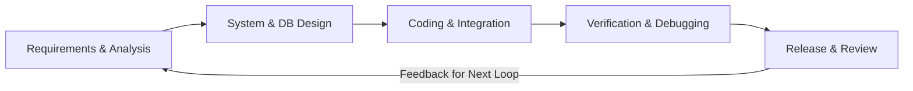
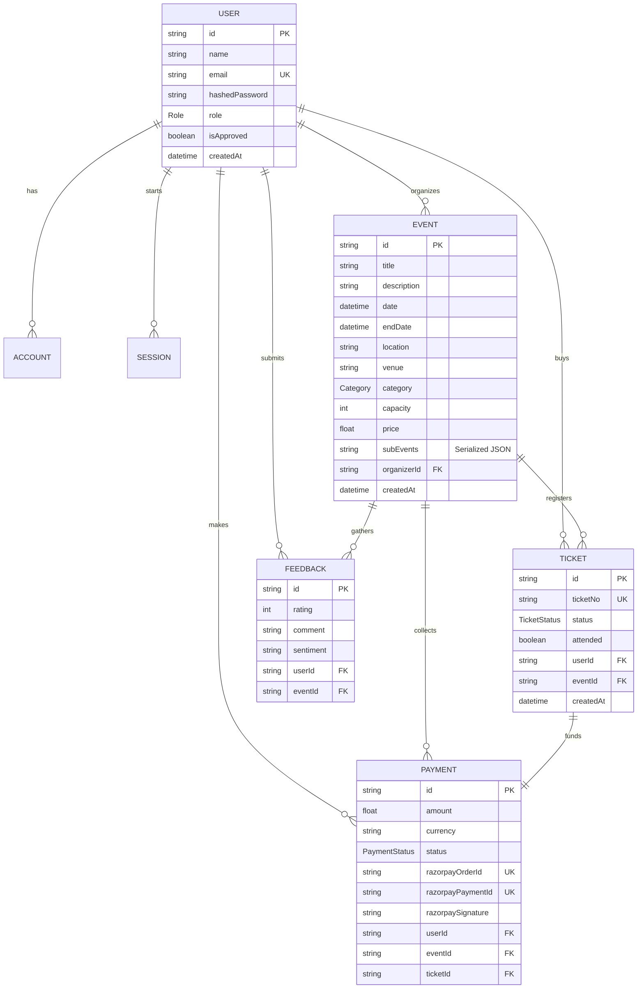
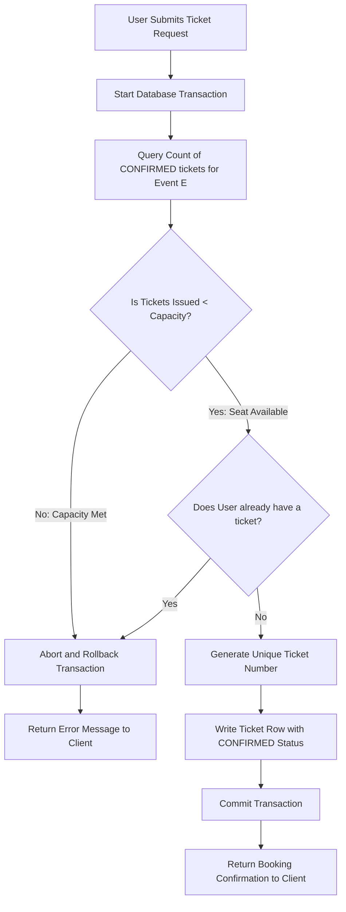
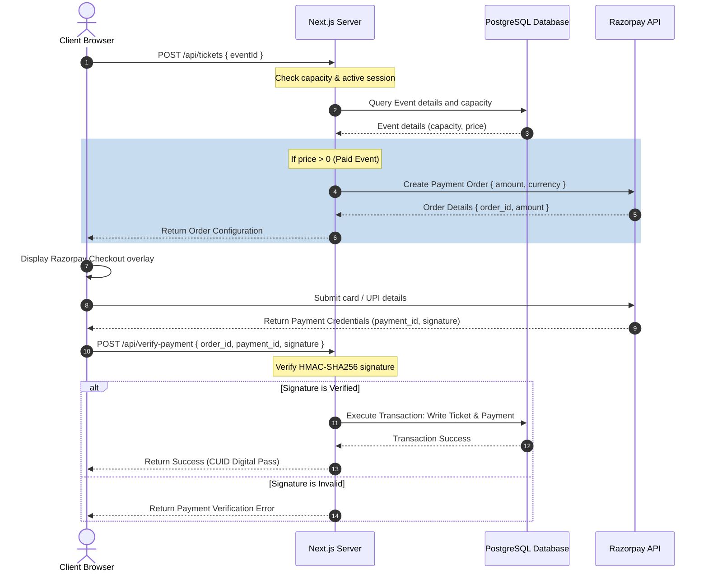

# Evently: A Robust Full-Stack Event Management and Secure Ticketing System

## Abstract

In modern academic and professional ecosystems, the organization and coordination of campus events have traditionally relied on fragmented, manual, or decentralized systems. These legacy practices often fail to offer role-based access control, real-time ticket availability checks, secure transaction structures, or dynamic agenda management. This thesis presents **Evently**, a comprehensive, secure, and highly interactive full-stack web application designed to solve these operational inefficiencies. 

Developed using the Next.js framework, React, PostgreSQL, and Prisma ORM, Evently enforces a three-tier architecture that isolates presentation, application logic, and data layers. The system implements a robust credentials-based authentication mechanism powered by bcrypt password hashing and state-free JSON Web Tokens (JWT) through NextAuth.js. To manage concurrent ticket bookings without venue overcapacity or double-booking, the application incorporates a transaction-isolated ticketing pipeline. Furthermore, Evently introduces a serialized database format utilizing JSON columns to manage multi-track agendas and presenter schedules dynamically within a single PostgreSQL cell, minimizing relational database overhead. Lastly, the platform integrates Razorpay for secure monetary transactions, providing a complete payment and ticket lifecycle—from booking confirmation to event-day door scanning and attendance logging. This work demonstrates how modern web architectures, type-safe database engines, and transactional workflows can be harmonized to deliver a resilient, high-performance solution for campus-wide event coordination.

---

## Table of Contents

* **Abstract**
* **Chapter 1: Introduction**
  * 1.1 Introduction
  * 1.2 Motivation
  * 1.3 Problem Statement
  * 1.4 Objectives
  * 1.5 Organisation of the Thesis
* **Chapter 2: Literature Survey**
  * 2.1 Overview of Traditional Event Management Practices
  * 2.2 Survey of Existing Web-based Event Platforms
  * 2.3 Research in Secure Authentication and Session Management
  * 2.4 Research in Transactional Integrity and Concurrency Controls
  * 2.5 Research in Dynamic Data Serialization (JSON in Relational Databases)
  * 2.6 Analysis of Payment Gateway Implementations
  * 2.7 Literature Summary and Identified Gaps
* **Chapter 3: Methodology**
  * 3.1 Software Development Life Cycle (SDLC) Model
  * 3.2 System Architecture
  * 3.3 Database Design and Entity-Relationship Modeling (ERD)
  * 3.4 Security and Authentication Framework
  * 3.5 Development Tools and Technology Stack
* **Chapter 4: Proposed Methodology**
  * 4.1 System Components and Modules
    * 4.1.1 Authentication & Authorization Module
    * 4.1.2 Event Lifecycle & Agenda Builder Module
    * 4.1.3 Concurrency-Safe Ticketing & Check-In Module
    * 4.1.4 Payment Processing & Order Verification Module
  * 4.2 Relational Schema & Database Dictionary Details
  * 4.3 Transactional Flow and Capacity Constraints
  * 4.4 Client-Server Communication Flows

---

## Chapter 1: Introduction

### 1.1 Introduction
In any modern educational institution or corporate setting, events represent a core pillar of collaboration, knowledge sharing, and networking. These gatherings range from small-scale academic workshops, seminars, and guest lectures to large-scale cultural festivals, sports tournaments, concerts, and career fairs. Efficiently managing these events requires coordinating multiple operational variables, including user registration, venue capacity tracking, ticketing, payment collection, agenda scheduling, and check-in confirmation. 

As digital systems become standard, the demand for unified, scalable, and secure event planning tools has grown. Historically, web-based applications were built as basic content management pages that merely displayed event details. However, contemporary requirements dictate that systems handle complex database transactions, prevent race conditions during peak registration windows, verify payments securely, and protect user credentials against data breaches. 

This thesis describes the design, architecture, and implementation of **Evently**, a secure full-stack event management and registration system. Built using a modern JavaScript/TypeScript stack featuring Next.js, React, Prisma ORM, and PostgreSQL, the system is designed to provide campus communities with a reliable, self-service portal to create, browse, check out, and log attendance for diverse events.

### 1.2 Motivation
The primary motivation for this project stems from the structural challenges faced by campus event organizers and attendees. In many academic campuses, such as Manipur University, events are organized using a mix of physical bulletin boards, social media groups, and localized online forms. This fragmented approach leads to several operational problems:
1. **Inefficient Information Sharing**: Students frequently miss valuable learning workshops or networking events because details are scattered across different platforms.
2. **Lack of Capacity Control**: Free or popular events often suffer from overcrowding. Without active ticketing systems, organizers cannot estimate attendance, leading to logistics and safety concerns.
3. **Complex Payment Handling**: For paid events, collecting cash or manual UPI transfers is error-prone, requiring organizers to manually verify hundreds of screenshots.
4. **Poor Agenda Updates**: Event schedules change frequently. Distributing updated programs to attendees via PDF or email is slow and unreliable.

By building a consolidated platform, we can address these challenges. Organizers gain a central tool to manage registrations, verify payments, and log attendance, while attendees receive a unified hub to find, register for, and track their participation in campus events.

### 1.3 Problem Statement
Traditional decentralized methods of event organization fail to maintain transactional integrity, secure user access control, and dynamic data flexibility. Specifically, the challenges include:
* **Concurrency and Overbooking**: Simple web forms allow submissions even after venue capacities are exceeded. When many users register simultaneously, race conditions can occur, leading to overbooking and venue violations.
* **Insecure Account Management**: Storing credentials in plain text or using weak hashing methods exposes user data to breaches. Additionally, without role-based access control (RBAC), unauthorized users can modify event details.
* **Rigid Database Schema Design**: Storing dynamic schedules with variable sub-events, times, and speakers in standard SQL databases typically requires complex, multi-table joins. This increases query complexity and database maintenance.
* **Manual Payment Reconciliation**: Manual verification of bank transfers is slow, insecure, and scales poorly. The lack of an integrated, secure API checkout pipeline prevents immediate registration confirmations.

A consolidated system is needed to solve these problems by integrating state-free token authentication, transactional capacity controls, dynamic JSON database serialization, and automated payment gateways.

### 1.4 Objectives
To solve these problems, the core objectives of this project are:
1. **Design a Unified Event Hub**: Build a responsive interface where attendees can browse, search, and register for events, and organizers can manage their schedules.
2. **Implement Secure Hashing and Authentication**: Establish a secure signup and sign-in pipeline using bcrypt for password hashing and NextAuth.js for JSON Web Token (JWT) session management.
3. **Enforce Role-Based Access Control**: Create distinct operational paths for Attendees, Organizers, and Administrators, requiring admin approval for new organizers.
4. **Build a Concurrency-Safe Booking Engine**: Create database transactions that count confirmed tickets and prevent overbooking, even during high-volume registration requests.
5. **Develop a Dynamic Agenda Builder**: Design a serialized JSON-in-text column model to store and render multi-track event schedules without database schema bloating.
6. **Integrate Automated Payments**: Connect the Razorpay API to process payments, verify signatures, and generate secure ticket passes automatically.
7. **Track Ticket Lifecycles**: Support ticket transitions (Confirmed, Used, Cancelled) to enable door scanning and attendance logging at the venue.

### 1.5 Organisation of the Thesis
This thesis is structured as follows to detail the design and implementation of the Evently system:
* **Chapter 1: Introduction** introduces the domain, motivation, core problems, and key objectives of the project.
* **Chapter 2: Literature Survey** reviews existing literature on event management systems, web frameworks, web security, database normalization, and transactional concurrency.
* **Chapter 3: Methodology** outlines the overall design approach, detailing the chosen SDLC model, the high-level system architecture, the database schema, security mechanisms, and the technology stack.
* **Chapter 4: Proposed Methodology** describes the detailed implementation of the individual system modules, including the code-level logic for authentication, capacity verification transactions, agenda serialization, and payment routing.

---

## Chapter 2: Literature Survey

### 2.1 Overview of Traditional Event Management Practices
Historically, administrative event organization relied heavily on manual systems, physical paper ledgers, and basic email communication. Literature shows that manual scheduling is prone to data duplication, miscommunication, and human error (Gowda et al., 2018). In educational campuses, the lack of centralized calendars led to scheduling conflicts, where two departments booked the same venue for different events. Physical ticketing required printing paper tickets, which added cost, was difficult to distribute, and could easily be lost or forged. Administrative staff spent significant time verifying registrations, collecting payments in cash, and manually logging attendance on paper sheets, slowing down entry on the day of the event.

### 2.2 Survey of Existing Web-based Event Platforms
To address manual inefficiencies, public platforms like Eventbrite, Meetup, and Luma emerged. Research into these systems indicates that while they offer global reach, they present limitations when applied to local, closed campus environments:
1. **High Commission Rates**: Commercial ticketing portals charge transaction fees per ticket, which is costly for student organizations and university budgets.
2. **Lack of Local Governance**: Public platforms do not allow administrators to audit, verify, or restrict who can create events within a university domain. This makes it difficult to maintain quality and prevent fraudulent postings.
3. **Rigid Customization**: Campus events often require specific integrations, such as roll-number validation, local student discounts, or campus room scheduling, which generic platforms do not support.

Therefore, building a self-hosted campus application is a practical alternative for institutional event management.

### 2.3 Research in Secure Authentication and Session Management
Securing web applications requires strong password hashing and session management. Research highlights that storing plain text passwords or using weak hashes (like MD5 or SHA1) is insecure due to rainbow tables and brute-force attacks (Oriyano, 2016). The industry standard is **bcrypt**, which uses the Blowfish block cipher and includes a random salt. The work factor (or cost parameter) allows the system to scale its computational cost over time, protecting against modern offline cracking attacks.

For session management in modern client-server models, stateless token-based authentication (such as JSON Web Tokens - JWT) has become standard:
* **Reduced Database Overhead**: Unlike session-based auth, where the server must query a session database for every request, a JWT is self-contained. It holds the encrypted user state (such as ID and role) and is verified cryptographically using a server secret.
* **Improved Scaling**: Stateless tokens allow the application to scale across multiple servers without requiring a central session database.

### 2.4 Research in Transactional Integrity and Concurrency Controls
In transactional web platforms, database concurrency is a critical issue (Elmasri & Navathe, 2017). When multiple users try to book the last available ticket at the exact same millisecond, a race condition can occur:
1. **The Read Step**: Both requests read the database and see one seat remaining.
2. **The Write Step**: Both requests proceed to create a ticket, resulting in an overbooked event.

To prevent this, systems must implement concurrency controls. In relational databases, this is managed using SQL transaction isolation levels or transaction blocks. By grouping the capacity read query and ticket write query into an atomic transaction, the database locks the affected records, ensuring only the first request succeeds while the second is rejected.

### 2.5 Research in Dynamic Data Serialization (JSON in Relational Databases)
Traditional relational database design relies heavily on normalization (Codd, 1970) to prevent redundancy. For events with variable schedules (e.g., sessions, speakers, times), a normalized approach requires an `Event` table and a separate `SubEvent` table linked by a foreign key. 

However, studies in database engineering show that frequent table joins can degrade query performance on high-traffic websites. With the rise of document-based data formats, modern relational databases like PostgreSQL support native JSON columns. Storing structured, hierarchical data (like a list of agenda items) directly inside a serialized text or JSON cell provides several benefits:
* **Simplified Schema**: Eliminates the need for a separate sub-events table and its associated schema migrations.
* **Fast Queries**: Fetches the event details and its entire program structure in a single, index-lookup query without performing joins.
* **Flexible Fields**: Allows organizers to modify the agenda structure without requiring database alterations.

### 2.6 Analysis of Payment Gateway Implementations
Online payments rely on secure integrations with third-party payment gateways like Razorpay, Stripe, or PayPal. Academic analyses of payment flows emphasize two key security principles:
1. **Asynchronous Payment Flow**: The frontend initiates the transaction with the payment gateway, the user pays on the gateway's checkout page, and the gateway returns a payment signature.
2. **Server-Side Validation**: The server must verify this payment signature using a cryptographic hash (HMAC-SHA256) combined with the gateway secret key before issuing the ticket. This prevents users from altering client-side variables to bypass payments.

### 2.7 Literature Summary and Identified Gaps
While existing literature covers authentication, database normalization, and payment systems, there is a gap in how these components are combined into a lightweight, self-hosted web app for campus ecosystems. Many university tools are either overly complex enterprise systems that are difficult to host locally, or simple CRUD templates that lack secure payments, concurrency safety, and flexible scheduling. 

This project aims to address these gaps by developing a full-stack system that combines secure bcrypt/JWT authentication, transaction-isolated booking, serialized agenda storage, and automated payment gateways into a single Next.js application.

---

## Chapter 3: Methodology

### 3.1 Software Development Life Cycle (SDLC) Model
This project followed an **Iterative and Incremental Development Model**. This approach allowed us to divide the application into distinct development cycles, testing and refining features at the end of each iteration:



1. **Phase 1 (Foundation)**: Focused on database setup, schema definitions, and basic page routing for events.
2. **Phase 2 (Core Features)**: Implemented authentication, role guards, transaction-based ticketing, agenda serialization, and payment gateway integration.
3. **Phase 3 (Testing & Refinement)**: Focused on concurrency testing, payment sandbox validation, and user interface polish.

### 3.2 System Architecture
Evently uses a **Three-Tier Architecture** implemented within a Next.js framework. This design separates the user interface, routing logic, and data storage to make the system modular, secure, and easier to maintain.

```mermaid
flowchart TD
    %% Presentation Layer
    subgraph UI ["Presentation Layer (React & Tailwind Client)"]
        Browser[Client Web Browser]
        Forms[Auth, Signup & Checkout Forms]
        DashboardView[Organizer & Admin Dashboards]
    end

    %% Application Layer
    subgraph AppServer ["Application Layer (Next.js App Server)"]
        Middleware[Next.js Middleware Role Guards]
        NextAuth[NextAuth.js JWT Processor]
        RouteHandlers[API Route Controllers]
        TransactionEng[Prisma Transaction Engine]
    end

    %% Data Layer
    subgraph Database ["Data Layer (PostgreSQL)"]
        PrismaClient[Prisma ORM Client]
        PostgresDB[(PostgreSQL Database)]
    end

    %% Client-Server Interactivity
    Browser -->|HTTPS Requests & Cookies| Middleware
    Forms -->|Form Submission| RouteHandlers
    DashboardView -->|Fetch Analytics & Lists| RouteHandlers
    
    Middleware -->|Authorize Context| NextAuth
    NextAuth -->|Fetch Profile Credentials| RouteHandlers
    RouteHandlers -->|Query Invocation| TransactionEng
    TransactionEng -->|Type-safe Access| PrismaClient
    PrismaClient <-->|SQL Executions| PostgresDB
```



* **Presentation Layer (Frontend Client)**: Built with React and styled with Tailwind CSS, this layer renders the user interface. It communicates with the backend via JSON-based REST APIs and handles routing on the client side.
* **Application Layer (Next.js Backend Server)**: Running server-side, this layer manages business logic, routing, security, and API endpoints. Next.js App Router route handlers process API requests, verify authentication headers, validate user inputs, and coordinate database transactions.
* **Data Layer (PostgreSQL Database)**: Manages data storage. The application communicates with PostgreSQL through the Prisma ORM client, which ensures type safety and handles query formatting.

### 3.3 Database Design and Entity-Relationship Modeling (ERD)
The database structure is designed to support users, events, tickets, payments, and feedback while maintaining relational integrity.



The relationships are defined as follows:
* **User & Event**: One-to-many relationship. An organizer (User) can create many events, but an event is organized by only one user.
* **User, Event & Ticket**: Many-to-many relationship resolved through the Ticket junction table. A User can register for multiple events, and an Event can issue tickets to multiple Users.
* **Ticket & Payment**: One-to-one relationship. A confirmed ticket for a paid event points to exactly one payment record, which validates its transaction status.

### 3.4 Security and Authentication Framework
To protect the system, security is integrated at three main levels:
1. **Data Security (Bcrypt)**: Passwords are encrypted before database insertion using `bcrypt` with `10` salt rounds. The system comparison prevents timing attacks.
2. **Session Security (JWT)**: NextAuth.js implements client-side JWT cookies signed with a server secret. This prevents clients from modifying token properties like email or role.
3. **Route Security (Next.js Middleware)**: Server-side middleware intercepts incoming requests to protected routes. It checks the JWT cookie:
   * Anonymous requests to dashboard directories are redirected to the sign-in page.
   * If a user tries to access a path that doesn't match their role (e.g., an attendee trying to access admin configurations), the request is blocked.

### 3.5 Development Tools and Technology Stack
* **Runtime & Framework**: Node.js v18+, Next.js 16 (App Router), React 19, and TypeScript.
* **Styling**: Tailwind CSS (v4) for responsive layouts and Lucide React for consistent icons.
* **Database Engine**: PostgreSQL, hosted locally or on a cloud platform.
* **Database ORM**: Prisma ORM, providing a type-safe interface and handling migration scripts.
* **Payment Gateway**: Razorpay Node SDK, processing transactions and verifying payment signatures.

---

## Chapter 4: Proposed Methodology

### 4.1 System Components and Modules

#### 4.1.1 Authentication & Authorization Module
This module handles user registration, password verification, and session control. It categorizes users into three roles:
* **ATTENDEE**: The default role. Attendees can search events, register for tickets, and view their dashboard.
* **ORGANIZER**: Organizers can create events, manage schedules, and track registrations. To maintain event quality, newly registered organizers are blocked from creating events until approved by an administrator (`isApproved = true`).
* **ADMIN**: Administrators review pending organizer requests, track system-wide metrics, and manage user roles.

#### 4.1.2 Event Lifecycle & Agenda Builder Module
This module manages event creation, validation, and scheduling:
* **Form Validation**: Checks that fields are complete, that capacities are positive integers, and that the event date is set in the future.
* **Agenda Serialization**: Instead of creating a separate relational table for multi-track schedules (which requires complex table joins), Evently serializes the program schedule into a JSON string inside a single text column (`subEvents`) in the PostgreSQL `Event` table.
  ```json
  [
    {"title": "Opening Keynote", "time": "09:00 AM", "speaker": "Dr. A. Sharma"},
    {"title": "Technical Session", "time": "10:30 AM", "speaker": "Prof. B. Singh"}
  ]
  ```
  During rendering, the frontend parses this JSON string to display the schedule as an interactive timeline on the event details page.

#### 4.1.3 Concurrency-Safe Ticketing & Check-In Module
This module handles booking requests. During peak registration, the system uses a database transaction to prevent overbooking:
1. **Read & Check**: The transaction queries the database to count active bookings (`status = CONFIRMED`) and compares it against the event capacity.
2. **Atomic Registration**: If seats are available, a unique CUID is generated for the ticket (e.g., `ticket_cuid12345`) and stored in the database.
3. **Rollback**: If capacity is reached, the transaction rolls back, preventing double bookings.
4. **Attendance Scan**: On the event day, organizers scan tickets to update their status from `CONFIRMED` to `USED`, registering attendance and preventing reuse.

#### 4.1.4 Payment Processing & Order Verification Module
For paid events, this module integrates Razorpay to handle checkouts securely:
* **Order Creation**: The client requests a checkout, and the server calls the Razorpay API to generate an order ID with the correct price.
* **Payment Form**: The client displays the Razorpay checkout overlay.
* **Signature Verification**: After payment, the client sends the payment details back to the server. The server verifies the signature using an HMAC-SHA256 hash containing the order ID, payment ID, and the local system secret key:
  $$\text{HMAC-SHA256}(\text{order\_id} + "|" + \text{payment\_id}, \text{secret\_key})$$
  Only when this hash matches the signature sent by Razorpay does the server create the ticket and confirm the registration.

### 4.2 Relational Schema & Database Dictionary Details
The database structure is built on PostgreSQL. Below are the details for the three core tables:

#### Table 1: User Schema
| Field Name | Data Type | Constraint | Default Value | Description |
| :--- | :--- | :--- | :--- | :--- |
| `id` | String | Primary Key | `cuid()` | Unique user identifier |
| `name` | String | None | `null` | Optional display name |
| `email` | String | Unique | None | RegEx validated email address |
| `hashedPassword` | String | None | `null` | Encrypted password string |
| `role` | Enum (`Role`) | None | `ATTENDEE` | Role mapping |
| `isApproved` | Boolean | None | `true` | Organizer approval status |

#### Table 2: Event Schema
| Field Name | Data Type | Constraint | Default Value | Description |
| :--- | :--- | :--- | :--- | :--- |
| `id` | String | Primary Key | `cuid()` | Unique event identifier |
| `title` | String | None | None | Event name |
| `description` | Text | None | None | Detailed description |
| `date` | DateTime | None | None | Start date |
| `endDate` | DateTime | None | `null` | End date |
| `location` | String | None | None | Location or room address |
| `capacity` | Integer | None | `100` | Seat capacity |
| `price` | Float | None | `0` | Price in INR (₹) |
| `subEvents` | Text (JSON) | None | `null` | Serialized agenda |
| `organizerId` | String | Foreign Key | None | Links to User table |

#### Table 3: Ticket Schema
| Field Name | Data Type | Constraint | Default Value | Description |
| :--- | :--- | :--- | :--- | :--- |
| `id` | String | Primary Key | `cuid()` | Unique ticket identifier |
| `ticketNo` | String | Unique | `cuid()` | Ticket verification token |
| `status` | Enum (`TicketStatus`) | None | `CONFIRMED` | Current state |
| `attended` | Boolean | None | `false` | Ticket scanned status |
| `userId` | String | Foreign Key | None | Links to User table |
| `eventId` | String | Foreign Key | None | Links to Event table |

### 4.3 Transactional Flow and Capacity Constraints
To prevent overbooking, the system executes ticket generation inside an atomic database transaction. The validation logic follows this equation:

$$\text{Tickets Issued} = \sum \text{Tickets where } \text{eventId} = E \text{ and } \text{status} = \text{CONFIRMED}$$

The booking transaction proceeds as follows:



By keeping these operations inside a transaction block, the database locks the table rows, preventing other concurrent queries from modifying the counts until the transaction completes.

### 4.4 Client-Server Communication Flows
The diagram below illustrates the request flow for paid registrations, showing how the frontend, backend, database, and payment gateway interact:



This communication structure ensures that every payment is verified on the server side before a ticket is created, protecting the system's transaction state.
