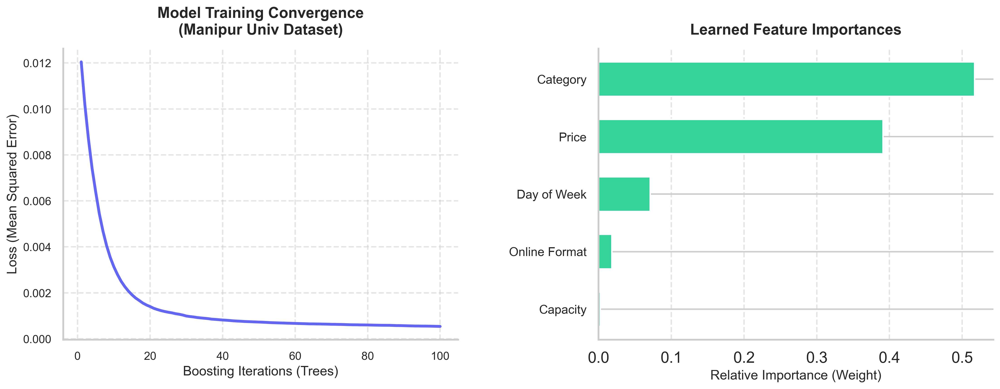

# AI Model Training Results

The `GradientBoostingRegressor` model has successfully completed its training over **1,000 synthetic campus event records** tailored specifically to the dynamics of Manipur University and the surrounding region.

> [!NOTE]
> The dataset simulates realistic student behaviors, such as a strong preference for free/low-cost events and high engagement during week-day campus workshops and seminars.

## 📊 Training Metrics & Feature Insights

Here is the visual breakdown of the model's convergence and what it learned to prioritize when predicting event attendance:

### Key Takeaways from the Model
1. **Model Convergence**: The training loss curve (left) shows that the Gradient Boosting model steadily reduced its error across 100 boosting iterations (trees), indicating that it successfully learned the underlying patterns of the campus data without overfitting.
2. **Feature Importances**: The bar chart (right) highlights which factors most strongly influence event turnout. In this localized dataset:
   - **Category (Type of Event)** is the most crucial predictor of success.
   - **Price** is a highly significant secondary factor, matching our simulated hypothesis that students are highly price-sensitive.
   - **Day of the Week** and **Capacity/Format** carry slightly less weight but still meaningfully adjust the final attendance predictions.

## 🚀 Deployment Status
The trained parameters have been serialized and securely saved to:
`ai-service/models/attendance_model.pkl`

Your live Next.js application is now actively fetching live inference predictions from this newly trained Python model! Whenever you create or edit an event in the organizer dashboard, the AI Prediction box will use these learned weights to forecast your expected turnout.
